<div align="center">


<p>
  <a href="https://github.com/WhileTrueBlackObelizk/shared-workspace-mcp/actions/workflows/ci.yml"></a>
  
  
  
  
  <a href="LICENSE"></a>
</p>

<b>Shared memory &amp; verified handover for AI agents.</b><br/>
<sub>Codex and Cowork pass work back and forth without losing the thread — and can't fake "done".</sub>

<sub><i>“Cairn” is the unofficial name for the <b>Shared Workspace MCP</b> (<code>shared-workspace-mcp</code>).</i></sub>

</div>

---

### 🔄 The gated pipeline

<div align="center"></div>

<div align="center"><sub>A step is <b>done</b> only when its evidence is <b>fresh, independent, and pre-registered</b> — not because the agent says so.</sub></div>

### 🏆 Earn the level

<div align="center"></div>

---

### ✨ What it does

| | | |
|---|---|---|
| 🧠 **Memory** | shared KV · activity · file events | survives restarts &amp; handovers |
| 🤝 **Handover** | one-call prepare / takeover | Codex ⇄ Cowork, nothing dropped |
| 🚦 **Gates** | hard vs advisory, evidence-graded | blocks self-declared "done" |
| 🕵️ **Freshness** | chain-of-custody on evidence | a stale check is not proof |
| 👀 **Four-eyes** | source-tracked checks | warns on self-certification |
| 🛎️ **Andon** | blocked gate → logged lesson | failures compound into learning |
| 🏅 **Self-score** | 0–10, evidence-based | quality trend, not vanity |
| 🔒 **Safe** | localhost · home-scoped · preset checks | no arbitrary shell |

<div align="center"><sub>🛬 aviation gates · 🔬 chain-of-custody · 🏭 Toyota andon · 🧪 pre-registration — borrowed where they beat the default.</sub></div>

---

<details>
<summary><b>⚡ Setup</b> — one command</summary>

<br/>

**Windows (PowerShell)**
```powershell
powershell -NoProfile -ExecutionPolicy Bypass -Command "irm https://raw.githubusercontent.com/WhileTrueBlackObelizk/shared-workspace-mcp/main/install.ps1 | iex"
```

**Linux (systemd user service)**
```bash
curl -fsSL https://raw.githubusercontent.com/WhileTrueBlackObelizk/shared-workspace-mcp/main/install.sh | bash
```

Then point your MCP client at:
```text
http://localhost:8765/sse
```

Claude Code can also spawn it over stdio:
```bash
claude mcp add --scope user shared-workspace -- python /path/to/shared-mcp/server.py --stdio
```

On Windows the installer wires up the Claude Desktop / Cowork config and removes the older duplicate local extension if present. Restart Claude, then ask Cowork for `workspace_dump` or `gate_check`. Liveness: `GET http://localhost:8765/health`.

</details>

<details>
<summary><b>🚀 Usage</b> — the whole trick</summary>

<br/>

Compact state outside the prompt, pulled only when it matters:

```text
workspace_dump
workspace_audit
workspace_maintain
get_recent_activity n=10
learning_search query="similar failure"
gate_check step=test root="C:\path\to\repo" source=cowork
gate_advance pipeline_id=my-task root="C:\path\to\repo" source=cowork
drift_report pipeline_id=my-task
goal_complete goal_id=my-task        # self-scores + levels up
```

Default pipeline: `intake → plan → implement → test → review → handover`.
Advance with `gate_advance` (not manual edits); a blocked gate writes a lesson.

</details>

<details>
<summary><b>🧰 Tools</b></summary>

<br/>

| Area | Tools |
| --- | --- |
| Memory | `workspace_write` · `workspace_read` · `workspace_dump` · `workspace_list` · `workspace_delete` |
| Maintenance | `workspace_audit` · `workspace_maintain` |
| Activity / files | `log_activity` · `get_recent_activity` · `get_file_events` |
| Handover | `handover_prepare` · `handover_takeover` |
| Code workspace | `repo_status` · `git_diff` · `search_code` · `read_file` · `run_check` (`ruff`/`mypy` too) |
| Gates | `gate_policy` · `gate_check` · `gate_status` · `gate_advance` · `verify_file_refs` · `drift_report` |
| Goals / pipelines | `goal_start` · `goal_update` · `goal_status` · `goal_complete` · `pipeline_create` · `pipeline_next` · `pipeline_status` · `pipeline_update_step` · `pipeline_finish` |
| Learning | `learning_log_error` · `learning_log_lesson` · `learning_search` · `learning_recent` |
| Tokens / feedback | `token_log` · `token_summary` · `estimate_tokens` · `context_snapshot` · `feedback_maybe` · `feedback_log` · `feedback_summary` |

</details>

<details>
<summary><b>🔒 Security</b> &amp; <b>🏗️ Architecture</b></summary>

<br/>

- Binds `127.0.0.1` only · file paths must stay under your home · `run_check` runs fixed presets, never arbitrary shell.
- Storage: UTF-8 JSON under `~/.claude/shared-workspace/`. No hosted DB, no paid service.
- Deep dives: [`ARCHITECTURE.md`](ARCHITECTURE.md) · [`handover-protocol.md`](handover-protocol.md) · [`SECURITY.md`](SECURITY.md) · agent rules in [`AGENTS.md`](AGENTS.md).

</details>

<div align="center"><sub>MIT · built stone by stone 🪨</sub></div>
