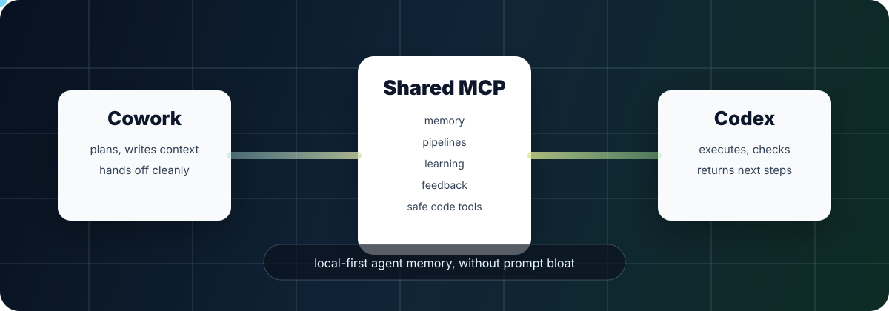
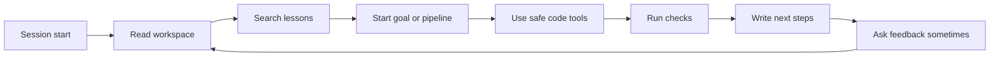

<p align="center">
  
</p>

<h1 align="center">Shared Workspace MCP</h1>

<p align="center">
  <strong>Local-first memory, pipelines, learning, feedback, and safe code tools for AI coding agents.</strong>
</p>

<p align="center">
  <a href="https://github.com/WhileTrueBlackObelizk/shared-workspace-mcp/actions/workflows/ci.yml"></a>
  <a href="https://github.com/WhileTrueBlackObelizk/shared-workspace-mcp/blob/main/SECURITY.md"></a>
  
  
</p>

Most agent setups lose the plot between chats. Shared Workspace MCP gives
Cowork, Codex, and other MCP clients the same tiny operating memory:

- what is active
- what changed
- what failed
- what lesson was learned
- what the next agent should do

No hosted database. No paid bot. No giant prompt ritual.

## One command

Windows PowerShell:

```powershell
powershell -NoProfile -ExecutionPolicy Bypass -Command "irm https://raw.githubusercontent.com/WhileTrueBlackObelizk/shared-workspace-mcp/main/install.ps1 | iex"
```

Linux with systemd user services:

```bash
curl -fsSL https://raw.githubusercontent.com/WhileTrueBlackObelizk/shared-workspace-mcp/main/install.sh | bash
```

Then connect your MCP client to:

```text
http://localhost:8765/sse
```

Claude Code can also spawn the server directly over stdio:

```bash
claude mcp add --scope user shared-workspace -- python /path/to/shared-mcp/server.py --stdio
```

The installers register this automatically when the `claude` command is
available.

On Windows, the installer also updates the Claude Desktop/Cowork config when it
can find it and installs an enabled local Claude Extension wrapper for Cowork.
Restart Claude after install, then ask Cowork to check for `workspace_dump` or
`gate_check`.

## Why it exists

Agents are useful. Agent handovers are usually mush.

This server makes the handover boring and inspectable. It stores just enough
state for the next agent to continue:

```text
workspace_dump
get_recent_activity n=10
get_file_events n=10
learning_search query="similar failure"
goal_status
pipeline_next pipeline_id=...
```

That is the whole trick: compact state outside the prompt, pulled only when it
matters.

## What you get

| Capability | Tools |
| --- | --- |
| Shared memory | `workspace_write`, `workspace_read`, `workspace_dump` |
| Activity log | `log_activity`, `get_recent_activity` |
| File events | `get_file_events` |
| Handover | `handover_prepare`, `handover_takeover` |
| Code workspace | `repo_status`, `git_diff`, `search_code`, `read_file`, `run_check` |
| Pipelines | `pipeline_create`, `pipeline_next`, `pipeline_update_step`, `pipeline_finish` |
| Token tracking | `estimate_tokens`, `token_log`, `token_summary`, `context_snapshot` |
| Learning loop | `learning_log_error`, `learning_log_lesson`, `learning_search`, `learning_recent` |
| Goals | `goal_start`, `goal_update`, `goal_status`, `goal_complete` |
| Feedback | `feedback_maybe`, `feedback_log`, `feedback_summary` |
| Drift gates | `verify_file_refs`, `gate_check`, `gate_advance`, `drift_report` |

## The agent loop



## Safe code tools

Use MCP tools before free-form shell access:

```text
repo_status
git_diff
search_code
read_file
run_check
```

`run_check` supports fixed presets only:

```text
git_status
python_compile
python_self_check
pytest
npm_test
npm_build
```

## Semi-auto handover

Use the handover tools instead of manually writing every key:

```text
handover_prepare target=codex reason="implementation" last_output="Plan ready" next_steps="1. Build it\n2. Run checks" source=cowork
handover_takeover agent=codex
```

`handover_prepare` writes `last_output`, `next_steps`, `handover_notes`, and
`session_owner`, then logs the handover. `handover_takeover` reads
`workspace_dump`, `get_recent_activity 10`, and `get_file_events 10`, and warns
if the `session_owner` points at someone else.

## Learning from errors

This does not mutate a model. It writes explicit local lessons you can inspect:

```text
learning_log_error task="publish" error="installer failed" cause="bad quoting" fix="parse check" lesson="Test installer syntax before push"
learning_search query="installer"
```

Stored in:

```text
~/.claude/shared-workspace/learning.json
```

## Goals and pipelines

Use a goal when the agent should optimize for an outcome:

```text
goal_start objective="Publish MCP repo" success_criteria="Repo public, installer works, docs updated" source=codex
goal_update goal_id=publish-mcp-repo status=active note="README done" source=codex
goal_complete goal_id=publish-mcp-repo outcome="Pushed to GitHub" source=codex
```

Use a pipeline when the task has phases or handover risk:

```text
pipeline_create name="Implement auth endpoint" source=codex
pipeline_next pipeline_id=implement-auth-endpoint
pipeline_update_step pipeline_id=implement-auth-endpoint step=plan status=done
pipeline_finish pipeline_id=implement-auth-endpoint note="Done and checked."
```

Default pipeline:

```text
intake -> plan -> implement -> test -> review -> handover
```

## Drift gates

Pipelines can be advanced through hardcoded gates instead of trusting the agent
to declare itself done.

```text
gate_policy
gate_check step=review root="C:\path\to\repo"
gate_advance pipeline_id=implement-auth-endpoint root="C:\path\to\repo"
drift_report pipeline_id=implement-auth-endpoint root="C:\path\to\repo"
```

Hard gates by step:

| Step | Requires |
| --- | --- |
| `intake` | active task, session owner, recent session/task activity |
| `plan` | `current_plan` and at least one goal |
| `implement` | repo status can run and there is diff/file-event evidence |
| `test` | a recent successful `run_check` result |
| `review` | a recent successful `verify_file_refs` result |
| `handover` | `last_output`, `next_steps`, and token usage logged |

The sharpest gate is coordinate verification:

```text
verify_file_refs text="server.py:1-20 proves the server has a docstring"
```

It verifies only that `server.py:1-20` exists, and optionally that a snippet is
really present in that range. It does not judge interpretation. That keeps the
agent honest without pretending a script can do code review.

## Clickable feedback

Ask for occasional feedback:

```text
feedback_maybe source=codex topic="handover-quality" chance=0.25
```

It returns local links:

```text
[Good](http://localhost:8765/feedback?id=...&rating=good)
[Mixed](http://localhost:8765/feedback?id=...&rating=mixed)
[Bad](http://localhost:8765/feedback?id=...&rating=bad)
```

The browser page writes to:

```text
~/.claude/shared-workspace/feedback.json
```

## Token savings in practice

A representative repo handover was measured with the built-in
`estimate_tokens` tool. The task was: inspect the repo, understand standards,
run checks, explain status, and write a handover.

| Approach | Estimated input tokens | Difference |
| --- | ---: | ---: |
| Full prompt with `README`, `ARCHITECTURE`, `handover-protocol`, `AGENTS`, `SECURITY` pasted in | `4,231` | baseline |
| MCP bootstrap prompt only | `137` | `96.8%` less |
| MCP bootstrap plus real tool outputs | `1,042` | `75.4%` less |

Measured tool output for the MCP path:

```text
workspace_dump       232 tokens
get_recent_activity  296 tokens
get_file_events      271 tokens
learning_search        5 tokens
repo_status           17 tokens
search_code           74 tokens
```

These numbers are local estimates, not provider billing. They are useful for
trend tracking and planning. Exact API usage should still be logged with
`token_log` when a provider returns real `input_tokens` and `output_tokens`.

## Secret safety

This repo tries hard to avoid accidental credential commits:

- `.gitignore` blocks env files, runtime JSON, keys, and local virtualenvs
- `scripts/check_secrets.py` scans tracked files with stdlib only
- `.githooks/pre-commit` runs the secret scan before commit
- GitHub Actions runs the same scan on push and PR
- Dependabot keeps Python and GitHub Actions dependencies fresh

Run it manually:

```bash
python scripts/check_secrets.py
```

## Storage

All state lives in:

```text
~/.claude/shared-workspace/
```

Files:

```text
kv.json
activity.json
file_events.json
pipelines.json
token_usage.json
learning.json
goals.json
feedback.json
check_runs.json
gate_results.json
evidence.json
```

## Manual start

Windows:

```cmd
start.bat
```

Linux/macOS:

```bash
./start.sh
```

Claude Code stdio mode:

```bash
python server.py --stdio
```

## Checks

```bash
python scripts/check_secrets.py
python server.py --self-check
python scripts/test_contract.py
```

## Architecture

See `ARCHITECTURE.md` for storage, tool groups, safety boundaries, and the
change policy.

## License

MIT. See `LICENSE`.
